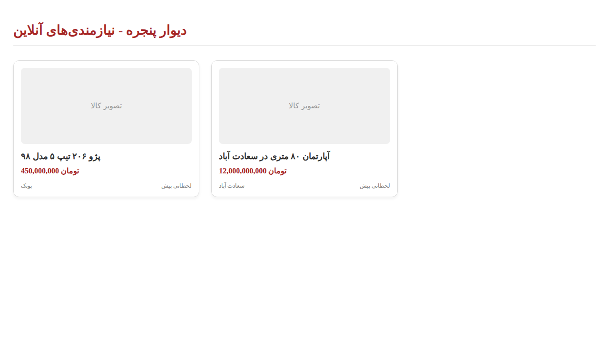
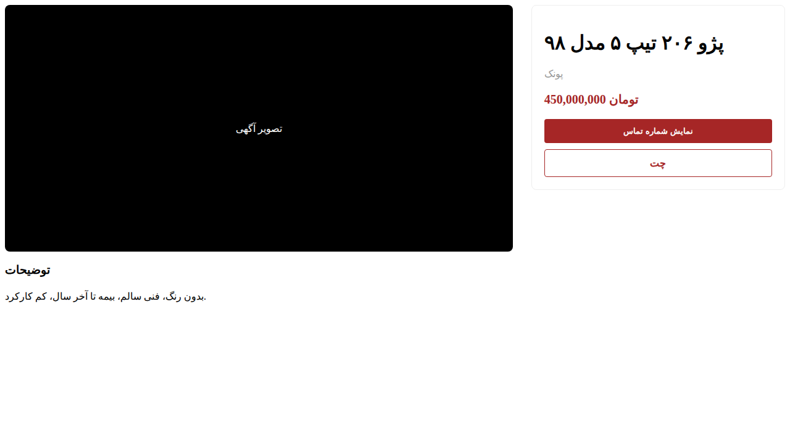
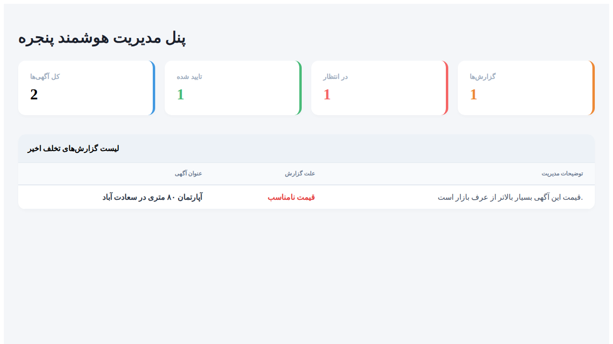

# سامانه جامع نیازمندی‌های آنلاین پنجره دات‌نت (PanjerehDotNet)

پروژه پنجره دات‌نت یک شبیه‌ساز کامل و پیشرفته از پلتفرم دیوار است که با استفاده از آخرین استانداردهای توسعه نرم‌افزار در دنیای دات‌نت طراحی و پیاده‌سازی شده است. این سامانه با تمرکز بر سرعت، امنیت و تجربه کاربری مدرن، تمامی امکانات لازم برای یک سایت نیازمندی‌ها را فراهم می‌کند.

## ویژگی‌های شاخص پروژه

- **معماری پاک (Clean Architecture):** جداسازی کامل لایه‌های دامنه، اپلیکیشن، زیرساخت و وب برای قابلیت نگهداری و تست‌پذیری بالا.
- **احراز هویت OTP:** سیستم ورود و ثبت‌نام سریع با شماره موبایل و مدیریت توکن‌های JWT.
- **چت آنی (Native Chat):** سیستم گفتگو بین خریدار و فروشنده با استفاده از SignalR بدون نیاز به رفرش صفحه.
- **موقعیت جغرافیایی:** ثبت و جستجوی آگهی‌ها بر اساس مختصات جغرافیایی و مناطق شهری.
- **رابط کاربری مدرن:** طراحی ریسپانسیو با Tailwind CSS شامل پشتیبانی از تم تاریک و روشن.
- **مدیریت تصاویر:** قابلیت آپلود و ذخیره‌سازی محلی تصاویر آگهی‌ها.
- **پنل مدیریت:** داشبورد اختصاصی برای نظارت بر آگهی‌ها، تایید محتوا و آمار سیستم.
- **بدون وابستگی خارجی:** تمامی کتابخانه‌های فرانت‌آند به صورت محلی در پروژه قرار دارند (بدون CDN).

## ساختار پوشه‌بندی

- **src/PanjerehDotNet.Domain:** موجودیت‌ها، اینام‌ها و اینترفیس‌های اصلی.
- **src/PanjerehDotNet.Application:** منطق تجاری، سرویس‌ها و DTOها.
- **src/PanjerehDotNet.Infrastructure:** پیاده‌سازی پایگاه داده (EF Core)، مخازن و هاب SignalR.
- **src/PanjerehDotNet.Web:** کنترلرهای API و صفحات Razor UI.
- **docs:** مستندات فنی و راهنمای توسعه‌دهندگان.
- **screenshots:** تصاویر محیط برنامه.

## راهنمای راه‌اندازی سریع

۱. **پیش‌نیازها:**
   - .NET 8 SDK
   - PostgreSQL (یا استفاده از SQLite پیش‌فرض برای تست)

۲. **تنظیمات دیتابیس:**
   در فایل `appsettings.json` در پروژه Web، رشته اتصال خود را وارد کنید. به صورت پیش‌فرض پروژه برای استفاده از SQLite تنظیم شده است.

۳. **اجرای دستورات Migration:**
   ```bash
   dotnet ef database update --project src/PanjerehDotNet.Infrastructure --startup-project src/PanjerehDotNet.Web
   ```

۴. **اجرای پروژه:**
   ```bash
   dotnet run --project src/PanjerehDotNet.Web
   ```
   پس از اجرا، دیتابیس به صورت خودکار با داده‌های اولیه (کاربران، آگهی‌ها و پیام‌های چت نمونه) پر می‌شود.

## مستندات تکمیلی

- [مستندات APIهای سیستم](./docs/readmeapi.md)
- [راهنمای اتصال اپلیکیشن اندروید](./docs/androidreadmeapi.md)

## اسکرین‌شات‌های محیط برنامه





## تکنولوژی‌های استفاده شده

- C# 12 & .NET 8
- Entity Framework Core
- PostgreSQL / SQLite
- SignalR
- Tailwind CSS
- JWT Bearer Authentication
- Newtonsoft.Json
